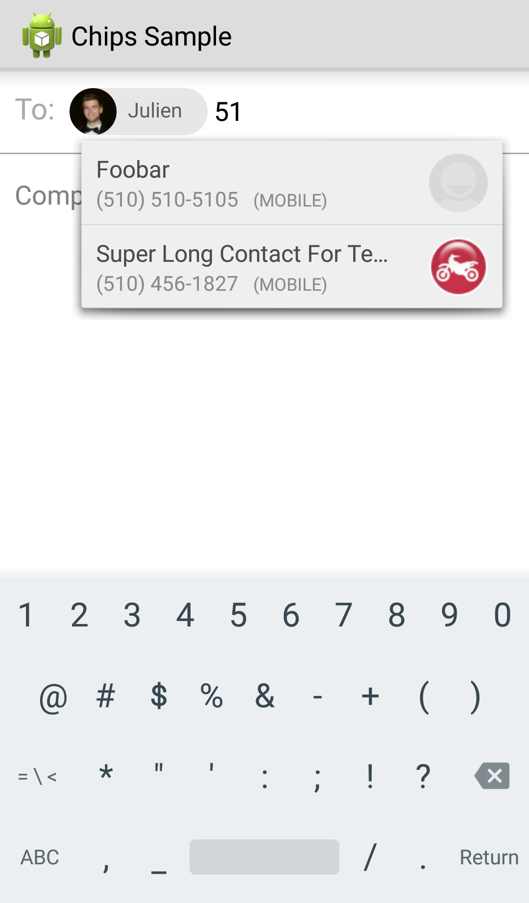
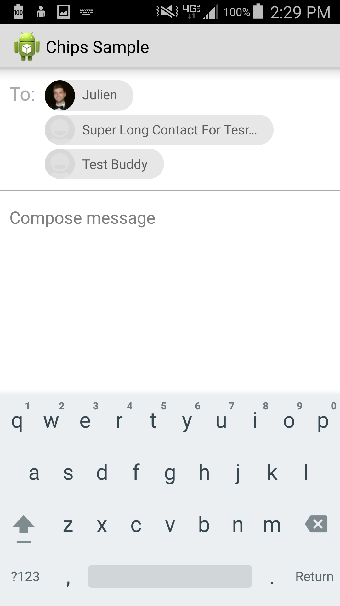

# Android Chips Edit Text #


Adding a chip                    |  Expanded text field                                      |  Shrinked text field
:-------------------------------:|:---------------------------------------------------------:|:-------------------------------------------------------:
  |    |  

This is a simple library based on Google's internal chips library and updated to have visuals reflecting the newly released "Material Design" standard as seen [here](http://www.google.com/design/spec/components/chips-tokens.html#chips-tokens-contact-chips).

Usage is extremely simple:

```java
// Creates an Autocomplete TextView for contacts with phone number
final RecipientEditTextView phoneRetv =
        (RecipientEditTextView) findViewById(R.id.phone_retv);
// Sets the maximum number of chips that the user can add
phoneRetv.setMaxNumberOfChipsAllowed(30);
// Sets the token used to commit the chip
phoneRetv.setTokenizer(new MultiAutoCompleteTextView.CommaTokenizer());
// Sets an adapter that will query phone numbers
phoneRetv.setAdapter(new BaseRecipientAdapter(BaseRecipientAdapter.QUERY_TYPE_PHONE, this));
```

OR

```java
// Creates an Autocomplete TextView for contacts with email
final RecipientEditTextView emailRetv =
        (RecipientEditTextView) findViewById(R.id.email_retv);
// Sets the maximum number of chips that the user can add
emailRetv.setMaxNumberOfChipsAllowed(30);
// Sets the token used to commit the chip
emailRetv.setTokenizer(new Rfc822Tokenizer());
// Sets an adapter that will query emails
emailRetv.setAdapter(new BaseRecipientAdapter(BaseRecipientAdapter.QUERY_TYPE_EMAIL, this));
```

You can get all of the current chips by using:

```java
DrawableRecipientChip[] chips = phoneRetv.getSortedRecipients();
```


## Gradle

To include in your gradle project:

```groovy
compile 'com.klinkerapps:android-chips:+@aar'
```
---

## License

    Copyright (C) 2014 Jacob Klinker

    Licensed under the Apache License, Version 2.0 (the "License");
    you may not use this file except in compliance with the License.
    You may obtain a copy of the License at

       http://www.apache.org/licenses/LICENSE-2.0

    Unless required by applicable law or agreed to in writing, software
    distributed under the License is distributed on an "AS IS" BASIS,
    WITHOUT WARRANTIES OR CONDITIONS OF ANY KIND, either express or implied.
    See the License for the specific language governing permissions and
    limitations under the License.
